# lum — data flow and architecture diagrams

Companion to [architecture.md](architecture.md). That document explains *why*
the design is what it is; this one shows *what runs where, what data crosses
each boundary, and in what representation*. Every diagram names the files it
describes so it can be checked against the code.

Read in order:

1. [Boundaries and protocols](#1-boundaries-and-protocols) — the map
2. [Process lifecycle](#2-process-lifecycle) — who starts whom, and when they die
3. [Request flows](#3-request-flows) — CLI, Neovim, MCP, curl, `lum top`
4. [Ingestion data flow](#4-ingestion-data-flow) — bytes → vectors
5. [Data representations](#5-data-representations) — the transformation ladder
6. [State machines](#6-state-machines) — readiness, retries, idle nesting
7. [Deletion and ordering invariants](#7-deletion-and-ordering-invariants)
8. [State ownership and identity](#8-state-ownership-and-identity)
9. [Observations on the current state](#9-observations-on-the-current-state)

---

## 1. Boundaries and protocols

Two processes, four client surfaces, five distinct wire protocols. Everything
below the REST line is private implementation.

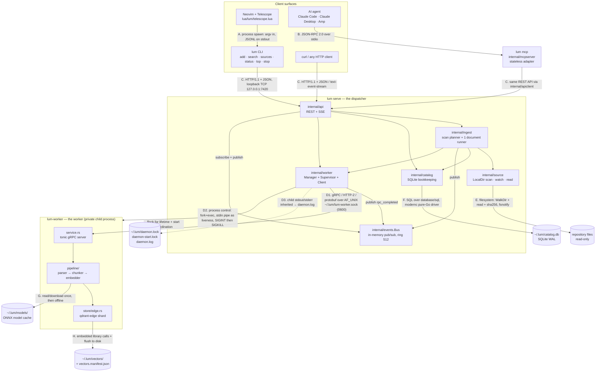

### Boundary reference

| # | Boundary | Transport | Encoding | What crosses | Direction |
|---|---|---|---|---|---|
| A | Telescope → CLI | `vim.system`-style job spawn via Telescope `finders.new_job` | argv in; newline-delimited JSON on stdout | `--root <repo> --jsonl --limit N -- <prompt>` out; one `SearchResult` per line back | one-shot, per keystroke batch |
| B | Agent → `lum mcp` | stdio pipes | JSON-RPC 2.0 (MCP), schemas inferred from Go structs | 4 tools: `search`, `add_source`, `list_sources`, `status` | bidirectional, long-lived |
| C | Any client → daemon | loopback TCP, `127.0.0.1:7420` (`LUM_HTTP_ADDR`) | JSON request/response; `text/event-stream` for `/v1/events` | the entire public API | request/response + one long-lived stream |
| D1 | Dispatcher → lum-worker | Unix domain socket `~/.lum/lum-worker.sock`, mode 0600 in a 0700 dir | gRPC over HTTP/2, protobuf (`proto/lum/v1/worker.proto`) | 5 RPCs; `x-request-id` metadata on every call | request/response + one client-streaming RPC |
| D2 | Dispatcher → lum-worker | POSIX process control | — | `--grpc-socket`, `--data-dir`, `--embedding-model` argv; stdin pipe held open as a parent-liveness signal (EOF ⇒ exit); `SIGINT`, escalating to `SIGKILL` after 10s | out only |
| D3 | lum-worker → dispatcher | inherited stdout/stderr | `tracing` text lines | logs, merged into `lum serve`'s stream or `daemon.log` | out only |
| E | Dispatcher → repository | filesystem | raw bytes | `WalkDir` + `os.ReadFile` + SHA-256; `fsnotify` inotify/FSEvents watches | read only, never writes |
| F | Dispatcher → catalog | in-process `database/sql` | SQL, `modernc.org/sqlite` (pure Go, no cgo) | sources, documents, hashes, chunk counts, ingest failures | read/write |
| G | lum-worker → model cache | filesystem + HTTPS on first run only | ONNX | `BAAI/bge-small-en-v1.5` (~70 MB) or the `-Q` quantized variant | download once, then read only |
| H | lum-worker → vector index | in-process library (qdrant-edge) | qdrant-edge storage files + a sidecar `vectors.manifest.json` | 384-dim vectors + self-describing chunk payloads | read/write, `flush()` before every ack |

Three properties follow from this table and are worth stating out loud:

- **No client has a privileged side channel.** Telescope shells out to the CLI;
  the CLI and MCP both go through `internal/apiclient`; nothing but the daemon
  opens `catalog.db`, `vectors/`, or `lum-worker.sock`.
- **Nothing binds a network interface except loopback.** The private hop is a
  filesystem socket, so it is reachable only by the owning Unix user, and no
  fixed private port can collide.
- **The narrow contract is load-bearing.** Repository discovery, `.gitignore`,
  watching, debouncing, retries, output formats, Telescope, and MCP all live
  *above* the 5-RPC line. File formats and chunking live entirely *below* it.

---

## 2. Process lifecycle

### 2.1 On-demand daemon start

Every command except `lum stop` and `lum serve` follows this path. `lum stop`
deliberately never spawns — nothing listening means nothing to stop.

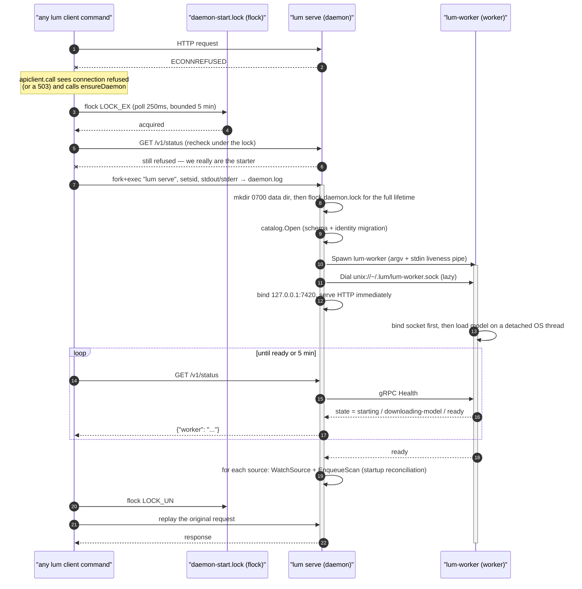

Key detail: lum-worker **binds its socket before it loads the model**, so `Health`
is answerable during a multi-minute first-run download. And the dispatcher
serves HTTP before lum-worker is ready, so `lum status` works throughout startup.

### 2.2 Startup and shutdown ordering

Ordering here is not incidental — each arrow prevents a specific failure.

```mermaid
flowchart LR
    subgraph up["Startup — cli/serve.go run(), top to bottom"]
        U1["1. data dir 0700"] --> U2["2. flock daemon.lock<br/>(held for the whole lifetime)"]
        U2 --> U3["3. catalog.Open"]
        U3 --> U4["4. Spawn lum-worker"]
        U4 --> U5["5. Dial gRPC (lazy)"]
        U5 --> U6["6. events.Bus"]
        U6 --> U7["7. worker.Manager"]
        U7 --> U8["8. net.Listen — must succeed<br/>before any scan starts"]
        U8 --> U9["9. ingest.New + snapshot loop"]
        U9 --> U10["10. serve HTTP"]
        U10 --> U11["11. async: WaitReady →<br/>watch + scan every source"]
    end

    subgraph down["Shutdown — reverse, via defers"]
        D1["cancelDaemon(): stop planner,<br/>document runner, watchers, debouncers"] --> D2["server.Shutdown (5s drain)"]
        D2 --> D3["defer server.Close / listener.Close"]
        D3 --> D4["dp.Close(): SIGINT lum-worker,<br/>wait ≤10s, else SIGKILL"]
        D4 --> D5["cat.Close()"]
        D5 --> D6["release daemon.lock — the only<br/>authoritative 'fully gone' signal"]
    end

    U11 -.->|"idle timer · SIGINT/SIGTERM · POST /v1/shutdown · HTTP error"| D1
```

Two consequences that clients depend on:

- The HTTP port stops answering at step **D3**, but the process lives through
  **D6**. `apiclient.Client.Stop` therefore waits on `daemon.lock`, not on the
  port. Same signal the on-demand spawn checks before starting a replacement.
- `rm -rf ~/.lum` while the daemon runs is **not** a reset: on Unix the open
  inodes survive the directory entry, so the daemon keeps serving the old
  catalog and index. `lum stop` first.

---

## 3. Request flows

### 3.1 `lum search --root <repo> "query"` — the primary path

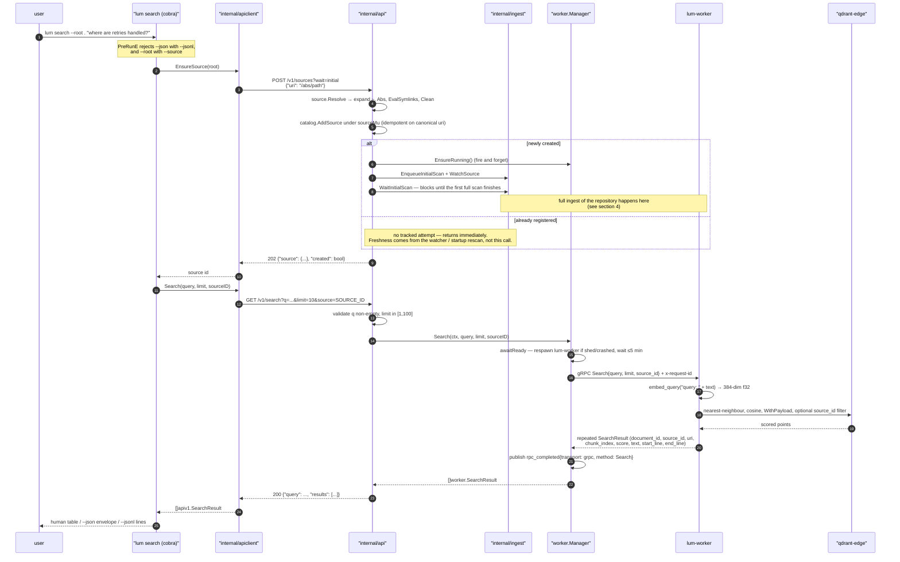

The chunk **payload is the whole answer** — no join back to the catalog, no
re-read of the file. That is what makes `--jsonl` sufficient for Telescope and
`curl` sufficient for a human.

### 3.2 Neovim / Telescope

Telescope holds no lum-specific state. It is a per-keystroke process spawner
over the CLI, and the debounce is a `sleep` in front of `exec`.

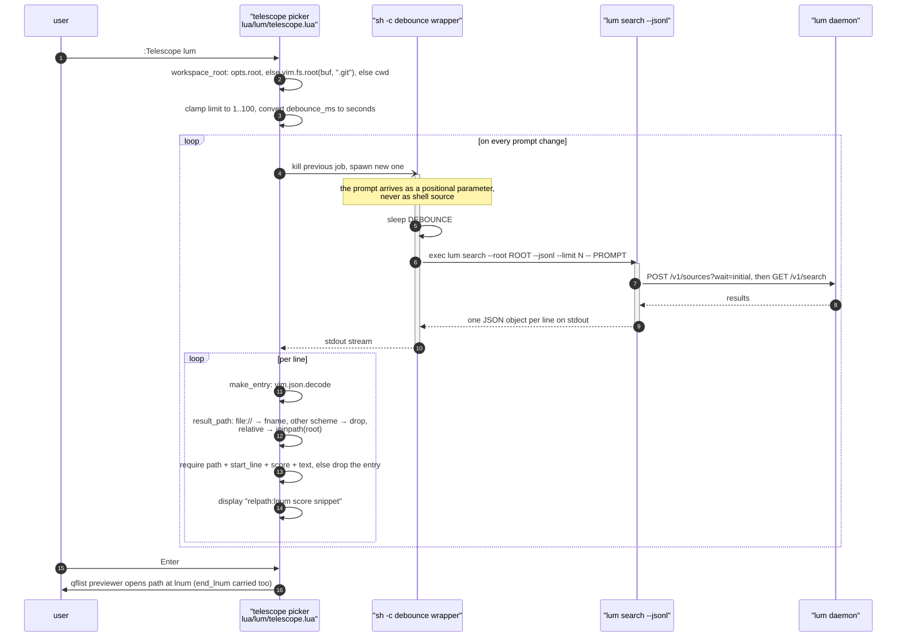

The debounce is a `sleep` in front of an `exec`, which is why the job Telescope
spawns is a shell rather than `lum` directly:

```sh
sh -c 'sleep "$1"; shift; exec "$@"' telescope-lum <seconds> \
  lum search --root <repo> --jsonl --limit <n> -- <prompt>
```

Everything after the script is a positional parameter, so a prompt containing
`$(...)`, backticks, or `;` is never interpreted as shell source. `exec`
replaces the shell, so Telescope's kill of the previous job reaches `lum`
itself and not an orphaned wrapper.

Other notes worth knowing when debugging the picker:

- The sorter is `sorters.highlighter_only` — ordering is **entirely** the
  server's cosine ranking; Telescope only highlights. Fuzzy re-sorting would
  fight the embedding.
- Because each keystroke respawns `lum search`, each keystroke also re-runs
  `POST /v1/sources?wait=initial`. That is cheap once registered (a canonical
  URI lookup) but it is a real round trip per query.
- `result_path` drops any non-`file://` scheme, so a future remote source type
  will not produce broken jump targets.

### 3.3 MCP

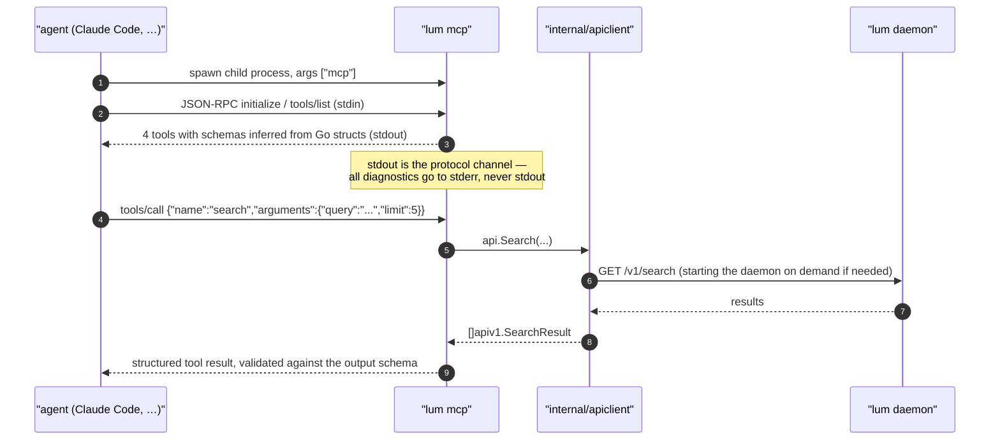

`lum mcp` opens no database, holds no state, and never touches gRPC. It can be
killed freely. The design constraint is deliberate: a capability that is not in
the REST API cannot become an MCP tool.

### 3.4 `lum top` and `GET /v1/events`

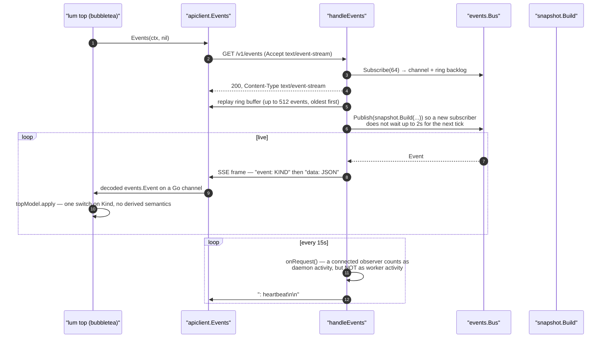

Publishers into the bus, and what each contributes:

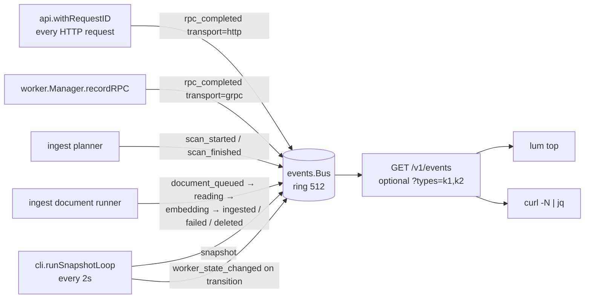

The dispatcher never reaches inside lum-worker for finer-grained progress. From
outside, an `IngestBatch` RPC's duration *is* the embedding phase for the batch
it carried — the same opacity the gRPC boundary has everywhere else.

---

## 4. Ingestion data flow

### 4.1 Level 0 — stores and flows

```mermaid
flowchart LR
    REPO[("repository files")]

    subgraph cp["dispatcher"]
        SCAN["LocalDir.Scan<br/>WalkDir + .gitignore + ext allow-list + sha256"]
        DIFF["planScan<br/>diff snapshot against catalog"]
        Q(["documentJob channel<br/>buffered 256"])
        WORKER["documentRunner<br/>read · batch · commit"]
    end

    CATDB[("catalog.db<br/>documents(source_id, uri, content_hash, chunk_count)")]

    subgraph dp["worker"]
        PARSE["ParserRegistry.parse"]
        CHUNK["WordWindowChunker"]
        EMBED["FastEmbedder.embed_passages"]
        UPSERT["EdgeStore.upsert_document + flush"]
    end

    VECDB[("vectors/<br/>points: id=UUIDv5(document_id/chunk_index)<br/>payload: provenance + text + line range")]

    REPO -->|"file bytes"| SCAN
    SCAN -->|"[]DocumentRef{uri, mime, sha256}"| DIFF
    CATDB -->|"known documents + hashes"| DIFF
    DIFF -->|"upsert / delete jobs"| Q
    Q --> WORKER
    REPO -->|"os.ReadFile — only for new/changed"| WORKER
    WORKER -->|"gRPC IngestBatch: header + 256 KiB frames"| PARSE
    PARSE -->|"ParsedText{text, starting_line}"| CHUNK
    CHUNK -->|"[]Chunk{index, text, start_line, end_line}"| EMBED
    EMBED -->|"Vec<Vec<f32>> 384-dim"| UPSERT
    UPSERT --> VECDB
    UPSERT -->|"chunk_count per document, in request order"| WORKER
    WORKER -->|"UpsertDocument(hash, chunk_count, ingested_at)<br/>after the ack — durability before bookkeeping"| CATDB
```

The single most important arrow is the last one: the catalog row is written
*after* qdrant-edge has flushed. Reverse it and a crash makes the next scan see
a matching hash, skip the document forever, and search silently miss it.

### 4.2 Planner and worker internals

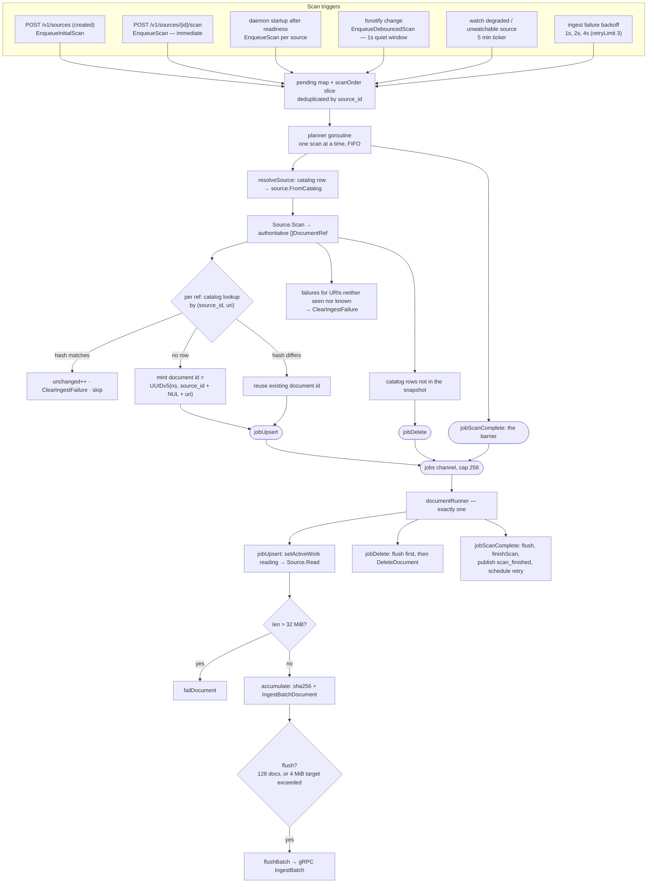

Why a single document runner: throughput is bounded by the embedding model,
so competing
workers would fight over cores rather than add parallelism. The job channel is
"the event bus in miniature" — a real broker could replace it without changing
what flows through it.

Why the `jobScanComplete` barrier: the planner emits deletes only after the
*complete* snapshot is in hand, and then waits on `run.done` before starting
the next scan. A partial snapshot must never be allowed to look like "these
files vanished".

### 4.3 `IngestBatch` wire framing

The one streaming RPC. Framing exists to stay under gRPC's per-message ceiling
while keeping many small files cheap.

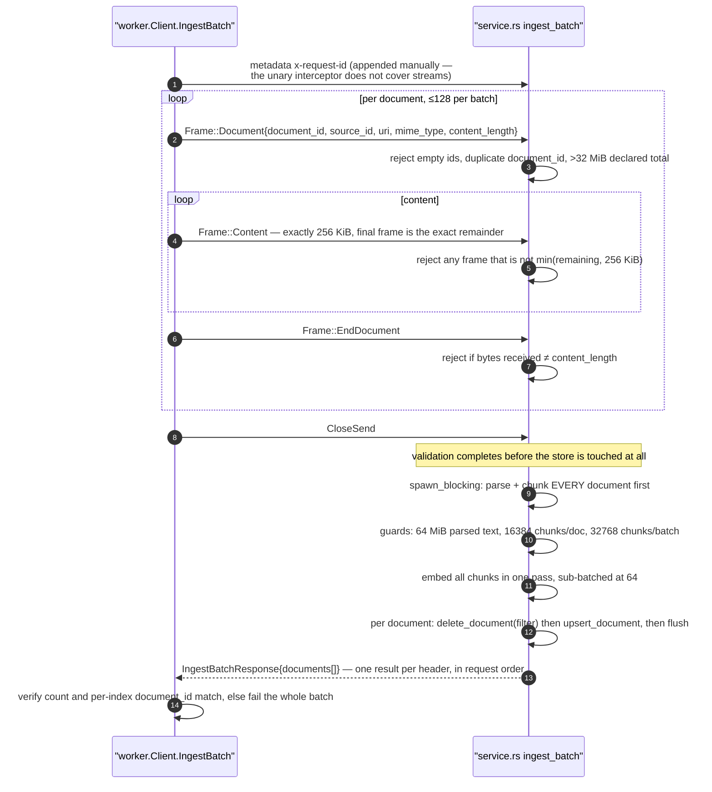

Two design choices visible here:

- **Parse and chunk everything before mutating the store.** An embedding
  failure therefore leaves every previously indexed document intact.
- **Per-document outcomes, not batch-level failure.** A parse error on one file
  becomes an `IngestBatchDocumentFailure{stage, message}` and the rest of the
  batch still commits. Stages are `PARSE`, `RESOURCE_LIMIT`, `STORE`. A
  transport-level error, by contrast, fails all documents in the batch, each
  recorded as its own retryable ingest failure.
- If lum-worker answers `Unimplemented`, the client silently falls back to
  per-document unary `IngestDocument` calls.

---

## 5. Data representations

The same file content wears eight different shapes between disk and screen.

| # | Where | Type | Shape | Key transformation applied |
|---|---|---|---|---|
| 1 | repository | `[]byte` on disk | file bytes | — |
| 2 | `LocalDir.Scan` | `source.DocumentRef` | `{URI, MimeType, ContentHash}` | extension → MIME lookup; SHA-256 of full content; `.gitignore` and hidden-dir exclusion. Deliberately content-free so unchanged files cost no read downstream. |
| 3 | `ingest.planScan` | `catalog.Document` + `documentJob` | `{ID, SourceID, URI}` + job kind | hash diff against `(source_id, uri)`; document ID minted as `UUIDv5(ns, source_id + "\x00" + uri)` — stable across re-ingests |
| 4 | `documentRunner` | `worker.IngestBatchDocument` | `{DocumentID, SourceID, URI, MimeType, Content}` | lazy `os.ReadFile`; 32 MiB reject; SHA-256 recomputed on the bytes actually sent; batched by count and byte target |
| 5 | gRPC wire | protobuf frames | header + N×256 KiB content + end | length-declared framing; `x-request-id` metadata |
| 6 | `pipeline/parser.rs` | `ParsedText` | `{text: String, starting_line: u32}` | UTF-8 lossy decode; markdown strips YAML front matter and advances `starting_line` so line provenance survives |
| 7 | `pipeline/chunker.rs` | `Vec<Chunk>` | `{index, text, start_line, end_line}` | 220-word window, 40-word overlap, whitespace-normalized; per-word line tracking yields inclusive 1-based ranges |
| 8 | `pipeline/embedder.rs` | `Vec<Vec<f32>>` | 384-dim, cosine-normalized | `"passage: " + text` prefix; sub-batched at 64 so an interactive query can take the model mutex between batches |
| 9 | `store/edge.rs` | qdrant-edge `PointStruct` | id `UUIDv5(ns, "{document_id}/{chunk_index}")`, payload `{document_id, source_id, uri, chunk_index, text, start_line, end_line}` | keyword payload indexes on `document_id` and `source_id`; `flush()` before ack |
| 10 | search return | `store::Hit` → `pb::SearchResult` → `worker.SearchResult` → `apiv1.SearchResult` | same 8 fields all the way up | payload round-tripped through `serde_json::Value` so lum-worker depends only on the serialized shape, not qdrant-edge internals. Missing `start_line`/`end_line` degrade to `0` = unknown, for points written by an older worker. |
| 11 | client output | text / JSON / JSONL / Lua table | `uri:start_line  score  snippet` | Telescope maps `uri`→path, `start_line`→`lnum`, `end_line`→`end_lnum` |

Query text takes a much shorter path: `"query: " + text` → 384-dim vector →
cosine ANN. The asymmetric `passage:`/`query:` prefixing is what bge models are
trained with, so it is not cosmetic.

### Request-ID propagation

One correlation ID stitches logs and events across all three languages.

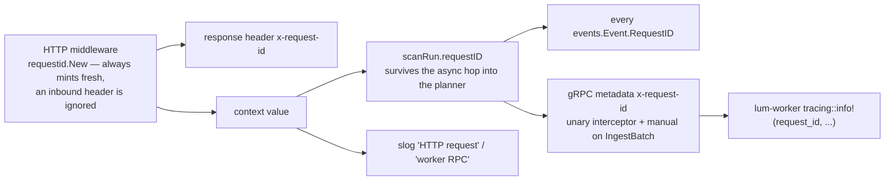

Background work with no HTTP origin (watch-triggered scans, retries) mints its
own ID via `requestIDFrom`, so nothing is ever uncorrelated.

---

## 6. State machines

### 6.1 Worker readiness

Four states come from lum-worker over gRPC; the last two are synthesized by the
dispatcher and never reported by lum-worker itself.

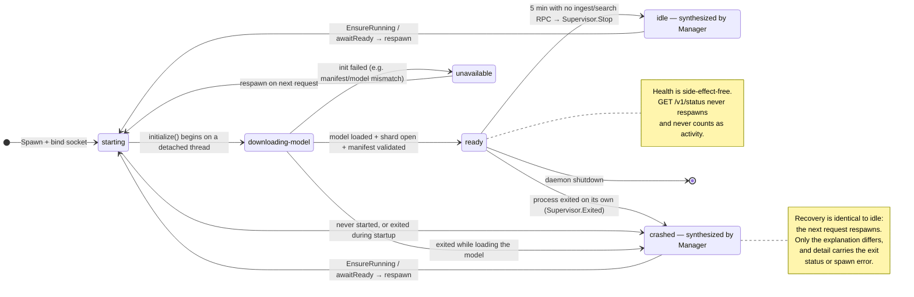

`Client.Health` also fails closed on a **contract version mismatch**: if
lum-worker's `contract_version` is not `"2"`, the result is `unavailable` with a
fatal `ContractMismatchError` rather than an optimistic "ready". That guards
against a mixed-build pair where a stale chunk-count field would silently leave
orphaned vectors behind.

### 6.2 Ingest failure and retry

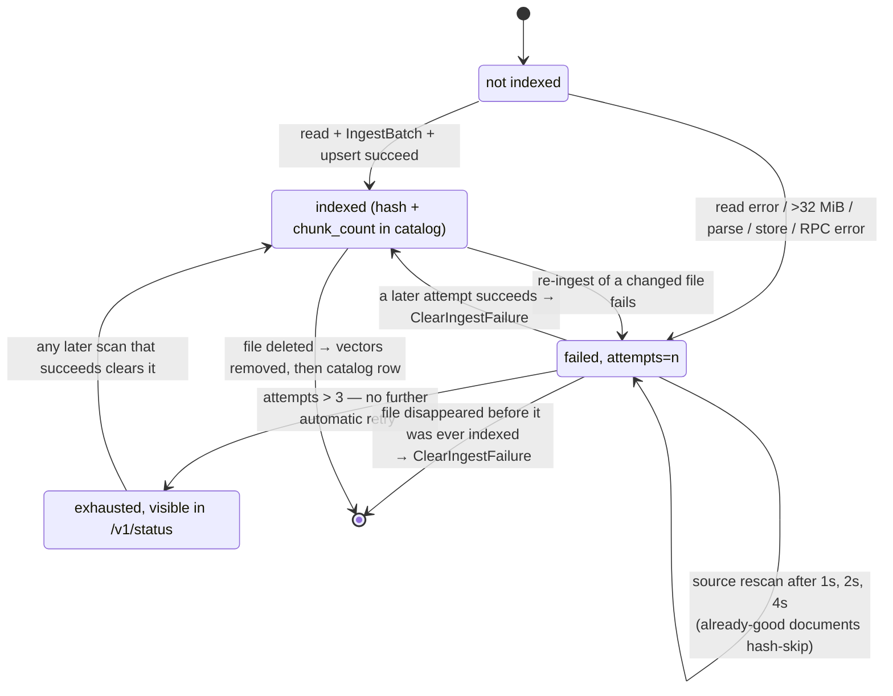

Failures are keyed `(source_id, uri)` and the retry is scheduled as *another
source reconciliation*, not a per-document retry — which is why it is cheap:
every already-successful document hash-skips during the retry scan. The backoff
is per-scan: `run.retryAfter` takes the **maximum** delay any document in that
scan asked for.

### 6.3 Two nested idle lifetimes

This is the payoff for splitting the processes at all, and the asymmetry in
what counts as activity is deliberate.

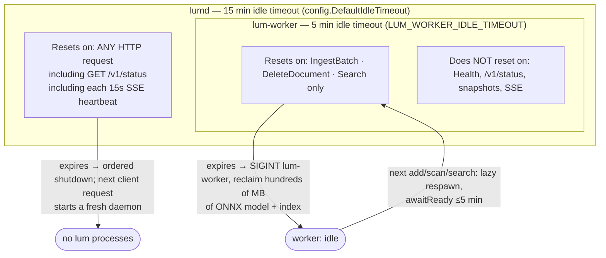

Concretely: leaving `lum top` open forever keeps the daemon alive forever (a
connected observer is real activity), but still lets the memory-heavy worker be
shed after 5 idle minutes. Monitoring lum does not keep the model warm.

---

## 7. Deletion and ordering invariants

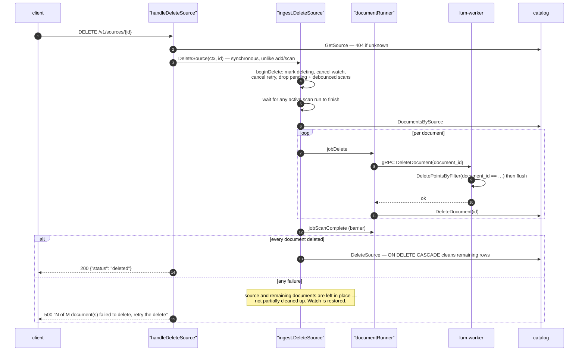

The ordering is the invariant: **vectors first, catalog row last.** `ON DELETE
CASCADE` only ever touches catalog rows, never the vector store, so deleting
the source row first would orphan its vectors as unreachable-but-still-
searchable ghosts.

The same rule appears in three places, always the same shape:

| Operation | Must happen first | Must happen second | Failure if reversed |
|---|---|---|---|
| ingest a document | qdrant-edge `flush()` | catalog `UpsertDocument(hash, chunk_count)` | crash loses vectors; next scan hash-skips forever; search silently misses the file |
| delete a document | `DeleteDocument` RPC | catalog `DeleteDocument` | orphaned, still-searchable points with no owning row |
| delete a source | every document's vectors | catalog `DeleteSource` | cascade wipes the rows that were the only way to find the vectors |
| shrinking re-ingest | `delete_document` filtered delete | `upsert_document` of the new, shorter chunk set | stale trailing chunks from the previous, longer version |

And one non-obvious ordering rule in the supervisor: `exec.Command`, **never**
`exec.CommandContext`. CommandContext SIGKILLs the child on context
cancellation, which races and beats the graceful stop that lets qdrant-edge
take its final flush.

---

## 8. State ownership and identity

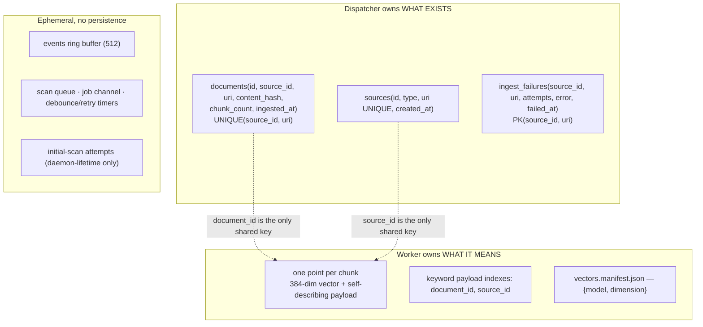

The two stores are never asked each other's question: the catalog is never
queried for "what matches this query?", and the vector index is never
enumerated to answer "what have we ingested?". Every fact has exactly one home,
and `document_id` / `source_id` are the only values that cross.

### Identity and keys

| Identity | Derivation | Why it is shaped that way |
|---|---|---|
| source id | random `uuid.NewString()` at registration | opaque; the canonical `uri` carries the `UNIQUE` constraint that makes registration idempotent |
| canonical source URI | `~` expansion → `filepath.Abs` → `EvalSymlinks` → `Clean` | the same directory reached by two paths must not register twice |
| document id | `UUIDv5(ns, source_id + "\x00" + uri)` | deterministic, so re-registering a repository re-derives the same IDs and re-ingest overwrites in place |
| document uniqueness | `UNIQUE(source_id, uri)`, **not** `uri` alone | a globally unique `uri` let a second overlapping source's scan find and silently adopt the first source's rows — misattributed provenance with no error raised |
| vector point id | `UUIDv5(ns, "{document_id}/{chunk_index}")` | re-ingest overwrites points in place rather than churning new ones |
| vector deletion | filtered delete on the `document_id` payload index | removes the cross-process invariant "catalog `chunk_count` must exactly match points on disk", which could drift after a hard crash |
| index compatibility | `vectors.manifest.json` `{model, dimension}`, plus an explicit legacy identity for pre-manifest indexes | standard and quantized bge produce incompatible vectors; a mismatch must be a startup error, not silently degraded recall |
| contract compatibility | `ContractVersion = "2"` checked on every `Health` | a mixed-build pair could leave stale chunks behind on a shrinking re-ingest |

---

## 9. Observations on the current state

What the "repository semantic search" pivot has and has not reached. Nothing
here is a bug report — these are the places where the product framing and the
implementation are not yet the same shape.

### Fully pivoted

- **Product surface.** `lum search --root <repo>` with idempotent discovery and
  registration means there is no setup step, and Telescope reaches it through
  the same CLI path. README, `docs/architecture.md`, `cli.Root`'s help text,
  and the flake's `lum` / `lum-nvim` outputs all describe one product.
- **Repository-shaped scanning.** Nested `.gitignore` with negation rules,
  hidden-tree exclusion applied consistently by both scans and watches,
  recursive watching with dynamic directory addition, and a 5-minute full
  rescan backstop when watch delivery degrades.
- **Code-shaped results.** Inclusive 1-based line ranges are tracked through
  parse → chunk → payload → gRPC → REST → CLI, never reconstructed by clients.
  That is what makes the Telescope jump-to-line and previewer work, and it is
  the single most repository-specific thing in the pipeline.
- **Packaging as one product.** The Nix wrapper pins `LUM_WORKER_PATH` to a
  store path, so the private worker is not a PATH lookup or a second install.

### Still prose-shaped underneath

These are the real quality ceiling for code search, in rough order of impact:

1. **The chunker is a prose chunker.** `WordWindowChunker` is a 220-word /
   40-word-overlap sliding window with whitespace normalization. Applied to
   source code it splits mid-function, mid-struct, and mid-expression, and
   collapses the indentation that carries much of code's structure. Line
   provenance is exact, but the *boundaries* are word-count driven. A
   syntax-aware chunker (tree-sitter, or even a brace/blank-line heuristic) is
   the highest-leverage change available and, by design, touches one file.
2. **No code parsers exist.** `localdir.go` maps ~50 extensions to MIME types
   like `text/x-go` and `text/x-rust`, but `ParserRegistry::with_defaults`
   registers only `MarkdownParser` and `PlainTextParser` — and `PlainTextParser`
   claims everything under `text/`. So every one of those MIME types resolves
   to lossy UTF-8 decode. The MIME mapping currently gates *which files are
   indexed*, not *how they are understood*. That is a defensible v1, but the
   type information is being computed and then discarded.
3. **The embedding model is trained on English prose.** `bge-small-en-v1.5`
   with `passage:`/`query:` prefixes is a good general retrieval model and a
   great local-first trade, but it is not code-trained. Natural-language →
   code queries ("where are retries handled?") are exactly the asymmetric case
   a code-trained embedder is built for.
4. **Directory exclusion depends on `.gitignore`.** `hiddenDirectory` only
   skips dot-prefixed names, and the comment in `localdir.go` about
   "node_modules-style caches" is not actually implemented. In a repository
   that does not gitignore `node_modules/`, `target/`, `vendor/`, or `dist/`,
   Lum will walk, hash, and index them.
5. **`Scan` reads and SHA-256s every indexable file, every time.** That runs on
   startup, after each debounced watch event, on the 5-minute fallback ticker,
   and on each retry. The code already names the fix (size+mtime pre-filter,
   hash only on suspicion) and it becomes noticeable, not theoretical, on a
   large repository.
6. **No result post-processing.** Results are raw cosine-ranked chunks. There
   is no dedup or collapse by file, no expansion to an enclosing symbol, and no
   re-ranking. Because chunks overlap by 40 words, adjacent chunks of the same
   function can plausibly occupy several of the top 10 slots.

### Freshness semantics worth being explicit about

`--root` guarantees *registration*, not *currency*:

- If the source is newly created, `POST /v1/sources?wait=initial` blocks for
  the entire first scan — correct, but on a large repository the first
  `lum search --root` (or first Telescope keystroke) is a full-index wait.
- If the source already exists from a previous daemon, `WaitInitialScan`
  returns immediately, because the tracked attempt only lives for the daemon
  that created it. Freshness then depends on the startup rescan and the
  watcher, both of which are asynchronous — so a query issued seconds after
  daemon start can legitimately see stale results with no signal that it did.
  A per-source "last completed scan" field in `/v1/status` would make this
  observable; today only aggregate counts are exposed.

### Documentation drift found while diagramming

- **Fixed.** `architecture.md` described a 503 gate on scan-triggering
  endpoints for the "worker still loading" case. That gate
  (`requireDataPlaneReady`) was real but was removed in `e3c8e4a`, replaced by
  `EnsureRunning()` plus a blocking `Manager.awaitReady` one level down; the
  prose had not been updated. The described *behavior* — a transient startup
  state never becoming a persisted ingestion failure — was correct throughout.
  The only 503 the API emits today is `GET /v1/events` with a nil bus.
- The README's `~/.lum/` tree omits `vectors.manifest.json`, which the
  model-switching paragraph further down does mention.

### Known gaps, carried forward from architecture.md

1. No `lum verify` to audit or repair catalog/vector drift after a hard crash.
   Flush ordering prevents it; nothing detects it.
2. Scan status is coarse — counts, not per-scan progress. A jobs table in the
   catalog would fix it, and would also fix the freshness-signal gap above.
