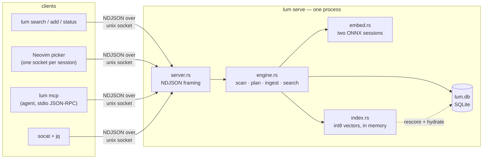
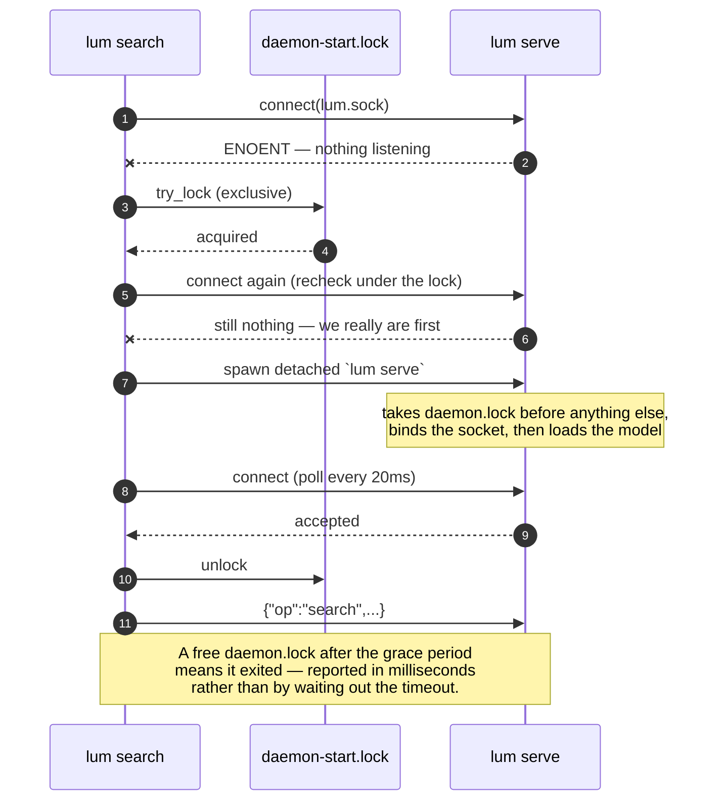
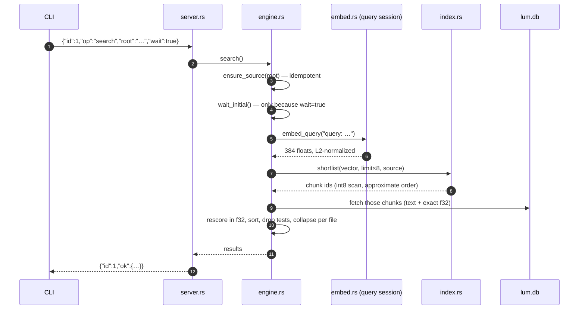
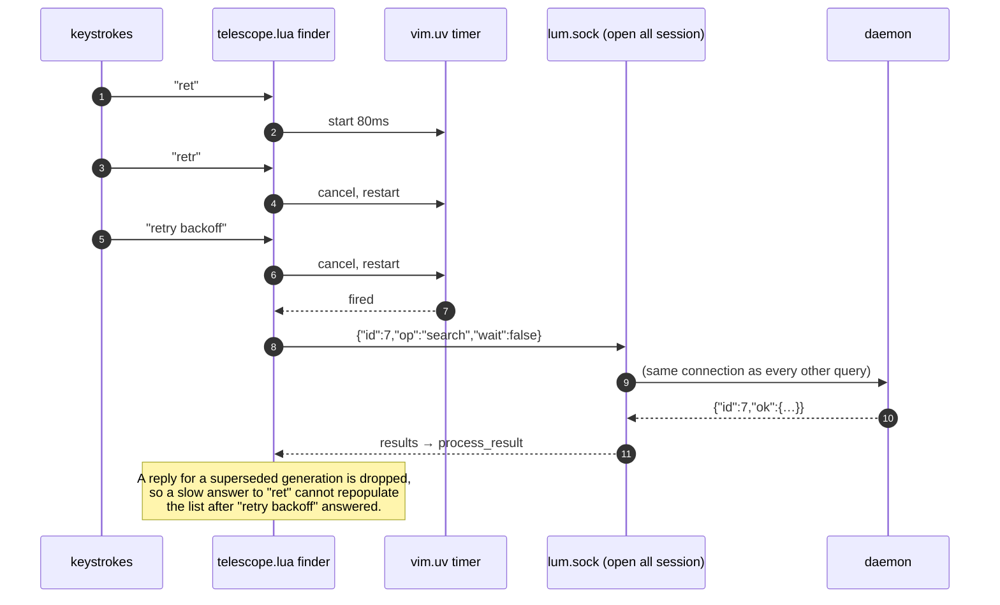
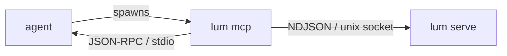
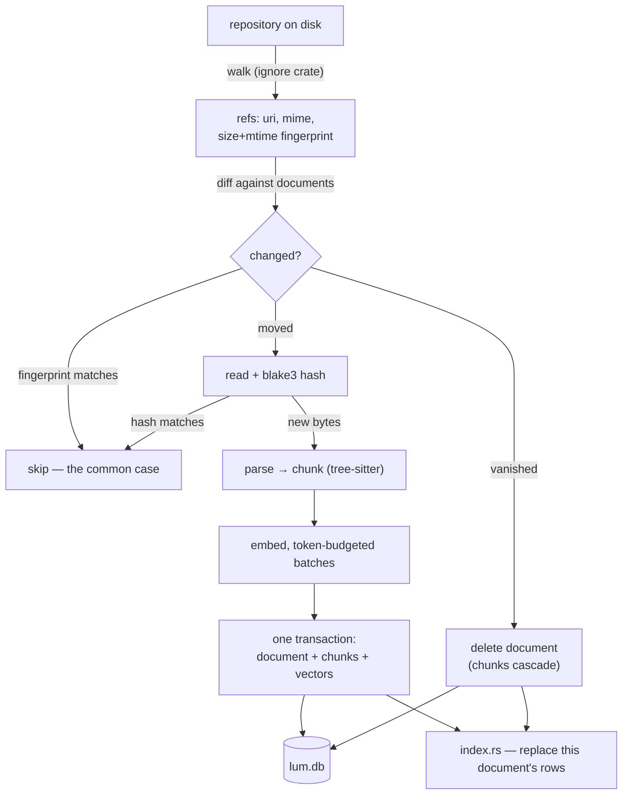
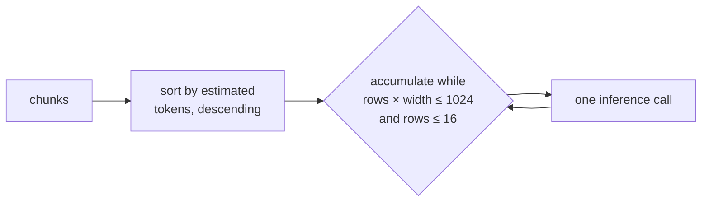
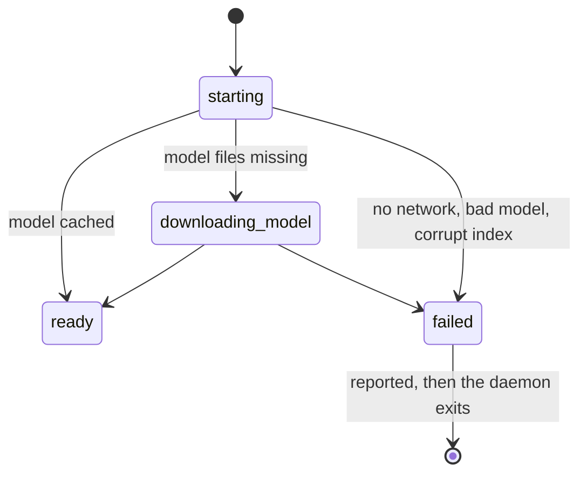
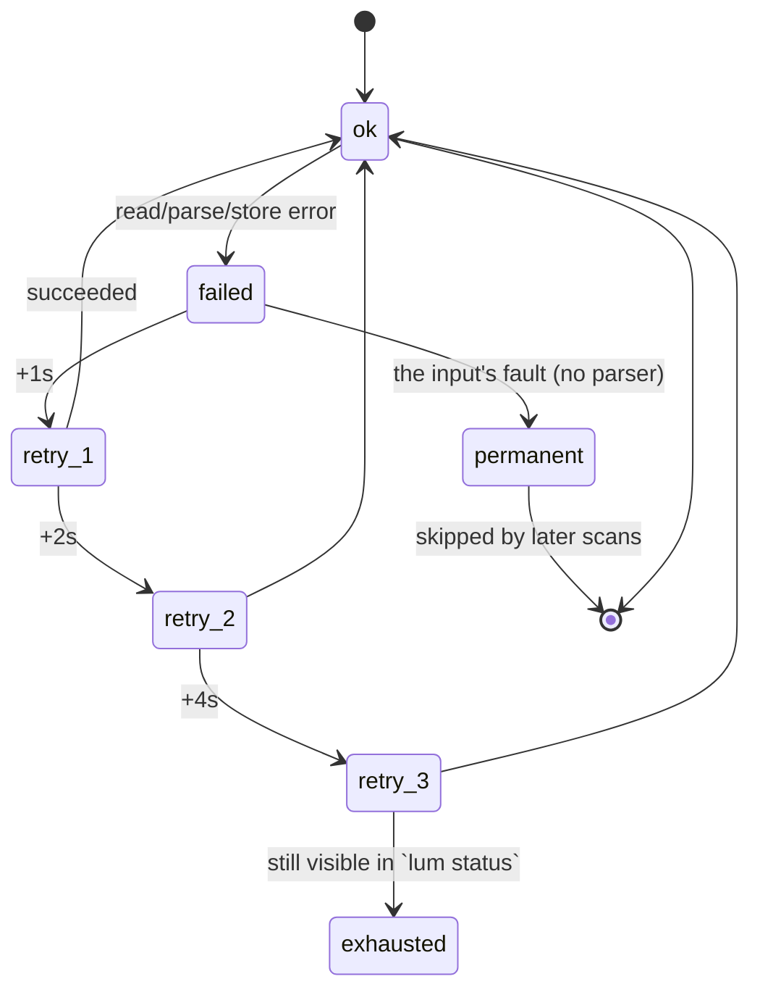
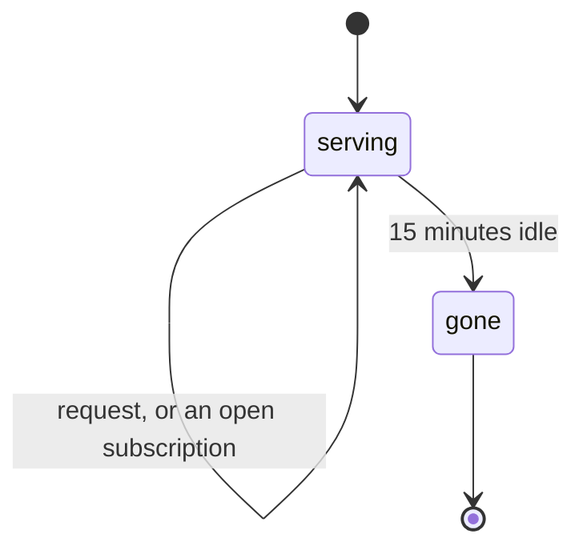

# lum — data flow and architecture diagrams

The same system [architecture.md](architecture.md) describes in prose, drawn
out: boundaries, request flows, ingestion, and the lifecycles.

## 1. Boundaries and protocols

There is one process and one boundary that matters: the socket between a client
and the daemon.

```mermaid
flowchart LR
    subgraph clients["clients"]
        CLI["lum search / add / status"]
        NVIM["Neovim picker<br/>(one socket per session)"]
        MCP["lum mcp<br/>(agent, stdio JSON-RPC)"]
        SH["socat + jq"]
    end

    subgraph daemon["lum serve — one process"]
        SRV["server.rs<br/>NDJSON framing"]
        ENG["engine.rs<br/>scan · plan · ingest · search"]
        EMB["embed.rs<br/>two ONNX sessions"]
        IDX["index.rs<br/>int8 vectors, in memory"]
        DB[("lum.db<br/>SQLite")]
    end

    CLI & NVIM & MCP & SH -->|"NDJSON over<br/>unix socket"| SRV
    SRV --> ENG
    ENG --> EMB
    ENG --> IDX
    ENG --> DB
    IDX -.->|"rescore + hydrate"| DB
```

### Boundary reference

| boundary | transport | who crosses it |
|---|---|---|
| client → daemon | NDJSON over `$LUM_DATA_DIR/lum.sock` | CLI, Neovim, MCP, anything with `socat` |
| agent → `lum mcp` | JSON-RPC over stdio | an MCP host |
| daemon → disk | SQLite | the daemon alone |
| daemon → HuggingFace | HTTPS, first run only | model download |

Everything inside the daemon — parsing, embedding, storage, search — is a
function call behind that one socket.

## 2. Process lifecycle

```mermaid
sequenceDiagram
    autonumber
    participant C as lum search
    participant L as daemon-start.lock
    participant D as lum serve

    C->>D: connect(lum.sock)
    D--xC: ENOENT — nothing listening
    C->>L: try_lock (exclusive)
    L-->>C: acquired
    C->>D: connect again (recheck under the lock)
    D--xC: still nothing — we really are first
    C->>D: spawn detached `lum serve`
    Note over D: takes daemon.lock before anything else,<br/>binds the socket, then loads the model
    C->>D: connect (poll every 20ms)
    D-->>C: accepted
    C->>L: unlock
    C->>D: {"op":"search",...}
    Note over C,D: A free daemon.lock after the grace period<br/>means it exited — reported in milliseconds<br/>rather than by waiting out the timeout.
```

Shutdown runs the same ordered path whether it was `lum stop`, the idle timer,
or a signal: stop accepting, remove the socket, drop the engine (database
connections, then the model), and only then release `daemon.lock`. `lum stop`
waits for that lock rather than for the socket to go quiet, because the
listener closes first and a quiet socket does not mean the process is gone.

## 3. Request flows

### 3.1 `lum search --root <repo> "query"`

```mermaid
sequenceDiagram
    autonumber
    participant C as CLI
    participant S as server.rs
    participant E as engine.rs
    participant M as embed.rs (query session)
    participant I as index.rs
    participant DB as lum.db

    C->>S: {"id":1,"op":"search","root":"…","wait":true}
    S->>E: search()
    E->>E: ensure_source(root) — idempotent
    E->>E: wait_initial() — only because wait=true
    E->>M: embed_query("query: …")
    M-->>E: 384 floats, L2-normalized
    E->>I: shortlist(vector, limit×8, source)
    I-->>E: chunk ids (int8 scan, approximate order)
    E->>DB: fetch those chunks (text + exact f32)
    E->>E: rescore in f32, sort, drop tests, collapse per file
    E-->>S: results
    S-->>C: {"id":1,"ok":{…}}
```

The shortlist is deliberately larger than the limit: collapsing can only
discard, so the search over-fetches to fill `limit` afterwards, and the rescore
needs headroom for near-ties the int8 scan may have ordered slightly wrong.

### 3.2 Neovim / Telescope

```mermaid
sequenceDiagram
    autonumber
    participant K as keystrokes
    participant T as telescope.lua finder
    participant P as vim.uv timer
    participant SK as lum.sock (open all session)
    participant D as daemon

    K->>T: "ret"
    T->>P: start 80ms
    K->>T: "retr"
    T->>P: cancel, restart
    K->>T: "retry backoff"
    T->>P: cancel, restart
    P-->>T: fired
    T->>SK: {"id":7,"op":"search","wait":false}
    SK->>D: (same connection as every other query)
    D-->>SK: {"id":7,"ok":{…}}
    SK-->>T: results → process_result
    Note over T: A reply for a superseded generation is dropped,<br/>so a slow answer to "ret" cannot repopulate<br/>the list after "retry backoff" answered.
```

`wait:false` is the point: the picker renders what is indexed now, and the rest
arrives as `$/progress` on the same connection.

### 3.3 MCP

```mermaid
flowchart LR
    A["agent"] -->|"spawns"| M["lum mcp"]
    M -->|"JSON-RPC / stdio"| A
    M -->|"NDJSON / unix socket"| D["lum serve"]
```

`lum mcp` holds no state and loads no model. It is the same kind of client the
CLI is.

## 4. Ingestion data flow

### 4.1 Level 0 — stores and flows

```mermaid
flowchart TD
    FS["repository on disk"] -->|"walk (ignore crate)"| REFS["refs: uri, mime,<br/>size+mtime fingerprint"]
    REFS -->|"diff against documents"| PLAN{"changed?"}
    PLAN -->|"fingerprint matches"| SKIP["skip — the common case"]
    PLAN -->|"moved"| READ["read + blake3 hash"]
    READ -->|"hash matches"| SKIP
    READ -->|"new bytes"| PARSE["parse → chunk (tree-sitter)"]
    PARSE --> EMBED["embed, token-budgeted batches"]
    EMBED --> TX["one transaction:<br/>document + chunks + vectors"]
    TX --> DB[("lum.db")]
    TX --> IDX["index.rs — replace this document's rows"]
    PLAN -->|"vanished"| DEL["delete document<br/>(chunks cascade)"]
    DEL --> DB
    DEL --> IDX
```

The single transaction is the whole consistency story: a document's
bookkeeping and its vectors commit together, so a crash can never record a
document as indexed while losing its vectors — a state the next scan would
otherwise skip forever, because the stored hash would match.

### 4.2 Batching

```mermaid
flowchart LR
    C["chunks"] --> S["sort by estimated<br/>tokens, descending"]
    S --> B{"accumulate while<br/>rows × width ≤ 1024<br/>and rows ≤ 16"}
    B --> R["one inference call"]
    R --> B
```

Sorted descending so the widest batch runs first and the arena's high-water
mark is set immediately rather than creeping up over a long index. Budgeting by
padded tokens rather than rows is what holds peak memory flat; the measurements
are in [architecture.md](architecture.md#memory).

## 5. State machines

### 5.1 Readiness

```mermaid
stateDiagram-v2
    [*] --> starting
    starting --> downloading_model: model files missing
    downloading_model --> ready
    starting --> ready: model cached
    starting --> failed: no network, bad model, corrupt index
    downloading_model --> failed
    failed --> [*]: reported, then the daemon exits
```

Four states, and `failed` carries the reason — the difference between a
daemon that explains itself and five minutes of polling a socket that will
never answer.

### 5.2 Ingest failure and retry

```mermaid
stateDiagram-v2
    [*] --> ok
    ok --> failed: read/parse/store error
    failed --> retry_1: +1s
    retry_1 --> retry_2: +2s
    retry_2 --> retry_3: +4s
    retry_3 --> exhausted: still visible in `lum status`
    failed --> permanent: the input's fault (no parser)
    permanent --> [*]: skipped by later scans
    ok --> [*]
    retry_1 --> ok: succeeded
    retry_2 --> ok
    retry_3 --> ok
```

The `permanent` branch exists because a PDF will not become parseable on the
third attempt, and rediscovering that once per scan forever is noise in every
subsequent status.

### 5.3 One idle lifetime

```mermaid
stateDiagram-v2
    [*] --> serving
    serving --> serving: request, or an open subscription
    serving --> gone: 15 minutes idle
    gone --> [*]
```

One process, one timer. The expensive transient — the ingest inference
session — is released the moment the queue drains, which is a function call
rather than a lifecycle.

## 6. Identity and ownership

| fact | home | key |
|---|---|---|
| registered directories | `sources` | `id` (UUID), `uri` unique |
| what was indexed | `documents` | `(source_id, uri)` |
| what it means | `chunks` | `(document_id, idx)`, cascade-deleted |
| what is searchable now | `index.rs`, in memory | rebuilt from `chunks` at startup |
| failures | `failures` | `(source_id, uri)` |

Documents are keyed on `(source_id, uri)` rather than `uri` alone: nothing
prevents two sources whose scans see the same path, and a globally unique `uri`
would let the second source's scan adopt the first's rows — misattributed
provenance, no error raised.

The in-memory index is derived state, rebuilt by reading `chunks` on startup.
There is no second artifact to keep in step and no format to migrate.
